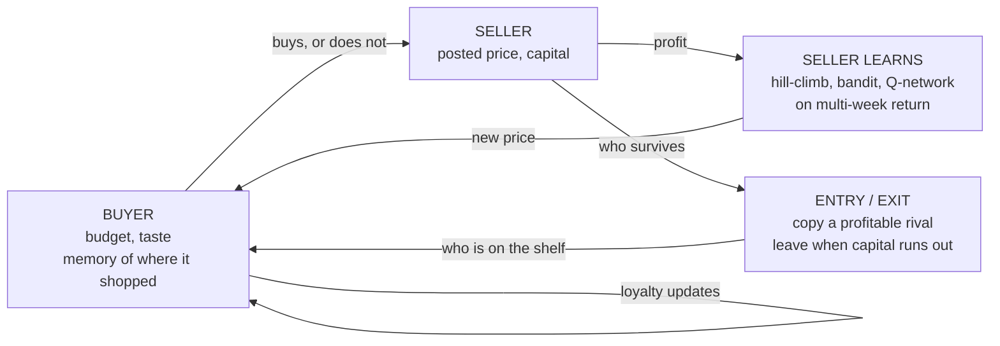
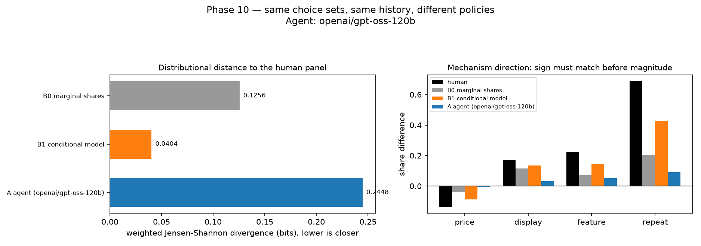
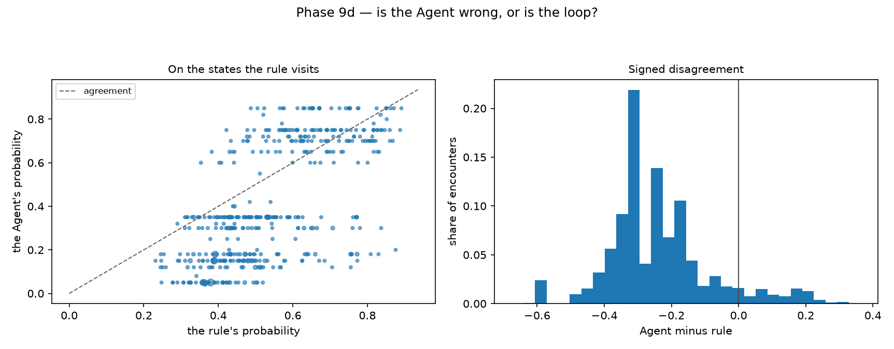
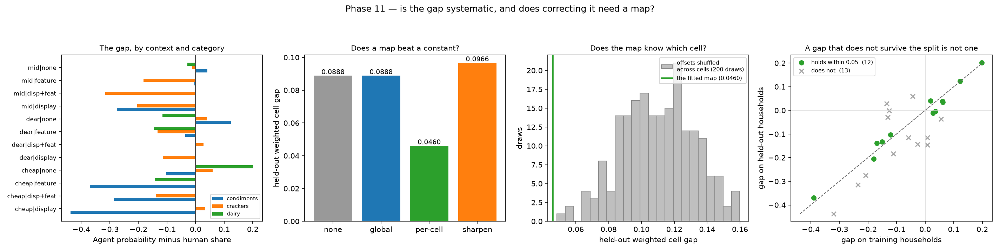
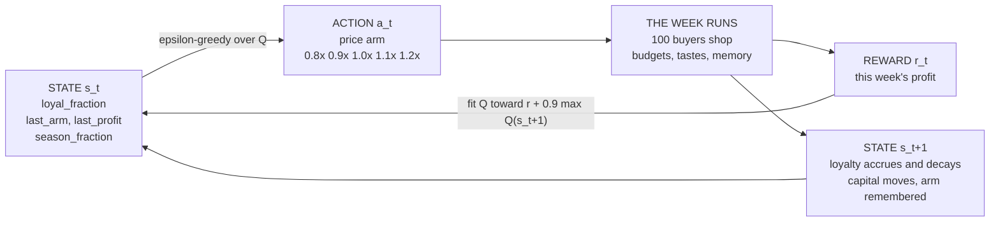

# Millbrook Market

**A synthetic consumer market built to find out when a simulated buyer can be
trusted — and, more often, when it cannot.**

Every phase writes down its question and its failure condition *before* it runs,
and reports the answer either way. **Most of the headline results are negative.**
Those are the ones worth reading.

---

## What it is

A market that **runs**, not a dataset that is scored. 100 buyers and up to 40
sellers, 22–110 weeks, and **everything each side does changes what the other
side faces next week.**



Three things make it a trajectory rather than a response:

| | |
|---|---|
| **State persists** | loyalty, capital, posted price and the seller set carry across weeks; only budget and inventory reset |
| **Agents learn** | sellers optimise price by ε-greedy, UCB1, LinUCB and a Q-network on discounted return; buyers can be a distilled network or an LLM |
| **Choices feed back** | a buyer's purchase changes its own future utility, the seller's profit, and whether that seller is still there |

**On the reinforcement learning, up front:** it is genuinely in here — four
rungs of it — and its headline result is a **null**. A Q-network on multi-week
return came in at **−1.3%** against a per-week bandit (CI [−2.8%, +0.1%],
equivalent), and in the environment built specifically to reward long horizons
it found **31%** of a gain that was known to exist. That is the finding, not a
disappointment: **policy complexity became valuable without becoming
learnable.**

---

## The difference this project is about

| most synthetic-consumer work | here |
|---|---|
| `Persona + Prompt → Response` | `Persona + State + Environment + Memory + Policy → Trajectory` |
| **static** — the world does not answer back | **interactive** — sellers reprice, firms enter and exit, memory accumulates |
| one answer, no history | 22–110 weeks of choices that change later choices |
| judged by whether it sounds right | judged against a pre-registered threshold |

A response can be graded by reading it. A **trajectory** can only be graded
against something — a control, a baseline, a real panel. That is the whole
design.

It is also what makes the hard question askable at all. A model can match
human behaviour **one step at a time** and still drift once its own choices
start driving its next observation. Measuring that gap needs a world that
reacts, and it is the gap this project keeps finding:

| | one step | closed loop |
|---|---|---|
| distilled network (9a) | matches the rule | **1.07×** — barely compounds |
| LLM agent (9d) | half the rule's probability | **1.42×** — the loop widens it |
| simulator vs the human panel (10) | fits well | **1.09×**, no drift with depth |

---

## What it found

### An LLM buyer is further from real humans than knowing only the brand shares



3,289 real purchase occasions, Ecdat::Cracker scanner panel. Same choice sets
for every arm.

| arm | distance to humans | log-loss |
|---|---|---|
| marginal brand shares | 0.1256 | 1.0696 |
| conditional choice model | **0.0404** | **0.7739** |
| **LLM Agent** | **0.2448** | **1.8966** |

**Every arm got all four mechanism directions right — including the floor.** So
sign agreement separates none of them. A test the marginal-share baseline passes
is not a test.

### The LLM's error is one number



Fitting the Agent against the rule that generates the world, over 447 states:

```
agent = −0.219 + 0.954 × rule
```

Slope ≈ 1. Its **comparative statics are right and its intercept is broken.**
Adding that one number back recovers **71.6%** of the collapse in a closed loop.

What *survives* the correction is a class bias: **+0.121** for high-income
buyers, **−0.063** for low-budget ones. Recalibration does not fix that, and
that is the part a client would be harmed by.

### Aggregate fidelity is cheap; individual fidelity is not

A model that knows **nothing about any individual household** matches the
aggregate choice distribution almost as well as one that knows every household
— 0.0035 against 0.0015 — while being **twice as wrong** per household.

A synthetic-consumer product graded on distributional match and sign agreement
can look excellent and carry no individual-level validity.

### The bias is correctable — but only as a map, not a constant



Three scanner panels, 8,499 real occasions. The Agent's gap against humans per
`(category, marketing context)`, fitted on half the households and scored on
the other half:

| correction | held-out error |
|---|---|
| none | 0.0888 |
| one constant | 0.0888 |
| **the map** | **0.0460** |
| one sharpening exponent | 0.0966 |

**The constant is worth nothing because the gap changes sign.** It runs from
**−0.44** where a condiment is cheap and on display to **+0.20** where a dairy
brand is cheap and unpromoted, and 7 of 25 cells flip sign across the split.
Averaged, it is **−0.0017**.

Shuffle the fitted offsets into the wrong cells and re-score: **0 of 200 draws**
match the real map. It knows *which* cell — the Agent under-reacts to promotion
and over-reacts to nothing.

### Six more, briefly

| | question | answer |
|---|---|---|
| **2** | Does buyer heterogeneity cause stratification? | **Yes** — but 73% of it is budget, not price sensitivity |
| **6** | Does memory create stable relationships? | **Yes**, 0.425 vs 0.316 — but the *control* is 0.316, not 0 |
| **7c** | Does market state predict the best price? | **No.** Skipped on the evidence rather than run |
| **7e** | Can a learner find a gain known to exist? | Right shape, **31% of the gain**. Complexity became valuable without becoming learnable |
| **9** | Does imitation error compound? | **Real but bounded** — saturates at ~1.7×, never material |
| **10** | Does the simulator's memory beat a model that knows the household? | **No** — −0.005 nats, CI spans zero |
| **11** | Is the human–Agent gap correctable? | **Yes, as a map** — halves held-out error; one constant does nothing |

Full detail: [`docs/phase_specifications.md`](docs/phase_specifications.md) ·
every run: [`experiment_log.csv`](experiment_log.csv)

---

## Four corrections worth more than the results

**A claim withdrawn.** Phase 10 first reported human loyalty as "3.4× stronger
than the simulator's". That compared an *upper bound* against a *causal
quantity*. Withdrawn, and the honest version recorded: a memoryless model with
household preferences predicts **97%** of the observed repeat rate.

**A measurement artifact caught.** Human memory looked flat across eight weeks —
which no decaying mechanism can produce. The cause was the train/test split:
odd lags averaged +0.016 and even lags +0.032, eight for eight. Parity-free, it
decays normally.

**A win that was in-sample.** The simulator arm first beat its baseline by 0.35
nats. It was reading answers it had been fitted to on half the data. Scored
properly: **0.005 nats, CI spanning zero.**

**Two bugs that cancelled.** Phase 11 first reported that no correction worked.
One clipped only the *corrected* arms before scoring, inventing a 0.21-nat win
for a −0.0017 offset; the other keyed the map on context alone, so crackers
were scored with yogurt's corrections. They pointed opposite ways and the run
reported the sum. Fixed, the map halves held-out error.

---

## See it

```bash
open viz/millbrook.html
```

Four tabs, one file, no server:

| tab | |
|---|---|
| **Market** | a season replayed — buyers, stalls, who went where |
| **Entry & Exit** | firms entering and leaving; week 11 shows the premium tier competed out |
| **Agent Inspector** | 1,591 LLM decisions with the model's own reasoning, beside what the rule said |
| **Experiments** | all 41 runs, their figures, and the commits behind them |

---

## How it works, in short

**Buyers** carry a budget, a price sensitivity, a fixed taste, and a memory of
where they shopped. Purchase is a logit:

```
U = intercept − α·(price/reference) + 1.5·preference + budget terms + γ·loyalty
P(buy) = sigmoid((U − 2) / τ)
```

**Sellers** are the reinforcement learner. One week is one step:



The `0.9` discount is about a **ten-week horizon** — long enough that a price
cut made now to build loyalty could pay for itself, which is precisely the
trade-off being tested for. Exploration decays 0.5 → 0.05.

**The buyer is not a reinforcement learner, and that distinction is
load-bearing.** It has state and a policy but **no reward** — it is a
hand-written rule, a network distilled from that rule, or an LLM. That is why
Phase 9 is *imitation* rather than RL, and why its question is whether a copied
policy drifts once its own choices drive its next observation, not whether it
earns more.

**Loyalty** is Guadagni & Little (1983): `L ← ρL + (1−ρ)·1{bought}`, bonus `γL`.
Three variants are kept side by side — none, a capped streak counter, and this
decaying stock — because **two of five conclusions turn on which one is used.**

**Nothing reads a class label.** Entry copies a profitable rival; exit follows
capital. That is what lets "the premium tier was competed out" mean something.

---

## Reproducing

```bash
python -m venv .venv && .venv/bin/pip install -r requirements.txt
.venv/bin/python -m pytest -q                          # 358 tests
.venv/bin/python experiments/phase8/run_phase8.py      # any phase
.venv/bin/python tools/build_combined_viz.py           # rebuild the page
```

| path | |
|---|---|
| `docs/phase_specifications.md` | the pre-registered spec — every gate, correction and result |
| `src/market_sim/` | engine, config, acceptance criteria, bandits, RL, LLM clients |
| `experiments/` | one runnable script per phase and per gate |
| `results/`, `experiment_log.csv` | outputs, each bound to a commit hash |
| `viz/millbrook.html` | the four tabs above |

Every logged run records the commit it ran at, and says `-dirty` out loud when
the tree was not clean. Eight rows were written that way before anything warned;
all eight were re-run clean and reproduced exactly.
