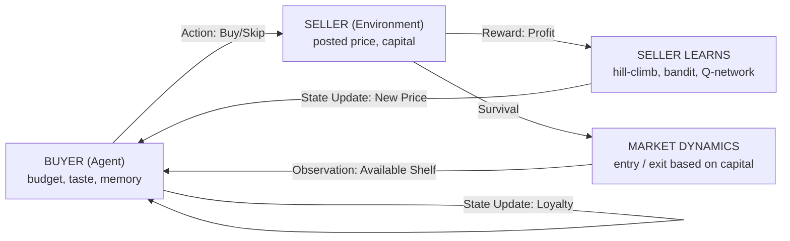

# Millbrook Market: A Closed-Loop Multi-Agent Environment for Behavioral Fidelity

[](https://www.python.org/)
[](https://opensource.org/licenses/MIT)
[]()
[](https://learned-market-five.vercel.app)

[Millbrook Market live demo](https://learned-market-five.vercel.app)

Four interactive views in your browser — the market replayed, firms entering and leaving, 1,591 LLM decisions with their reasoning, and all 42 logged runs. No install, no server.

**A synthetic consumer market built to find out when a simulated buyer can be trusted — and, more often, when it cannot.**

Every phase writes down its question and its failure condition *before* it runs, and reports the answer either way. **Most of the headline results are negative.** Those are the ones worth reading.

> **TL;DR:** We benchmarked LLMs and RL agents against real human scanner panel data (8,499 occasions). The headline result? **Aggregate fidelity is cheap; individual closed-loop fidelity is not.** LLMs drift significantly when their own choices drive their next observations. Policy complexity became valuable without becoming learnable.

---

## See It in Action

No server required. Explore the simulation trajectories, agent reasoning, and market dynamics directly in your browser:

```bash
open viz/millbrook.html
```

*(Note: Insert a 5-second GIF here showing the Market Entry/Exit tab or Agent Inspector running)*

Four tabs, one file, zero dependencies:

- **Market:** A season replayed — buyers, stalls, who went where.
- **Entry & Exit:** Firms entering and leaving; week 11 shows the premium tier competed out.
- **Agent Inspector:** 1,591 LLM decisions with the model's own reasoning, beside what the rule said.
- **Experiments:** All 41 runs, their figures, and the commits behind them.

## The Core Problem: Static vs. Interactive Evaluation

Most synthetic-consumer work evaluates models statically. Millbrook Market evaluates trajectories.

| Standard LLM Evaluation | Millbrook Market |
|---|---|
| Persona + Prompt → Response | Persona + State + Environment + Memory + Policy → Trajectory |
| Static — the world does not answer back | Interactive — sellers reprice, firms enter/exit, memory accumulates |
| One answer, no history | 22–110 weeks of choices that change later choices |
| Judged by whether it "sounds right" | Judged against a pre-registered empirical threshold |

A response can be graded by reading it. A trajectory can only be graded against a baseline (a real panel). A model can match human behaviour one step at a time and still drift once its own choices start driving its next observation.

| Agent Type | One-Step Fidelity | Closed-Loop Drift |
|---|---|---|
| Distilled Network | Matches the rule | 1.07× — barely compounds |
| LLM Agent | Half the rule's probability | 1.42× — the loop widens it |
| Simulator vs. Human Panel | Fits well | 1.09× — no drift with depth |

## Key Empirical Insights

### Insight 1: An LLM buyer is further from real humans than a marginal baseline

Tested on 3,289 real purchase occasions (Ecdat::Cracker scanner panel). Every arm got all four mechanism directions right, meaning sign agreement separates none of them.

| Arm | Distance to Humans | Log-Loss |
|---|---|---|
| Marginal brand shares | 0.1256 | 1.0696 |
| Conditional choice model | 0.0404 | 0.7739 |
| LLM Agent | 0.2448 | 1.8966 |

### Insight 2: The Illusion of Aggregate Fidelity

A model that knows nothing about any individual household matches the aggregate choice distribution almost as well as one that knows every household (0.0035 vs. 0.0015) — while being twice as wrong per household. A synthetic-consumer product graded on distributional match can look excellent while carrying zero individual-level validity.

### Insight 3: Identifying the Latent Class Bias

Fitting the LLM Agent against the ground-truth rule over 447 states yields: `agent = −0.219 + 0.954 × rule`.

Its comparative statics are right, but its intercept is broken. Adding that one number back recovers 71.6% of the collapse in a closed loop. What survives the correction is a class bias: +0.121 for high-income buyers, −0.063 for low-budget ones.

### Insight 4: Bias is correctable — but only as a map, not a constant

The Agent's gap against humans changes sign depending on the context (e.g., −0.44 for cheap/promoted condiments vs. +0.20 for cheap/unpromoted dairy). A single constant correction is worth nothing (averages to −0.0017). Mapping the bias halves the held-out error (0.0888 → 0.0460).

*(For full details on all 11 phases, including RL baseline failures and memory stability, see [`docs/phase_specifications.md`](docs/phase_specifications.md))*

## System Architecture & RL Dynamics

The environment runs 100 buyers and up to 40 sellers. Everything each side does changes what the other side faces next week.



### The Asymmetric Learning Loop

**Sellers (Reinforcement Learners):** Optimize for long-horizon return. Action space is discrete price multipliers. Policy is updated via Q-learning (γ = 0.9, ~10-week horizon), balancing exploration (ε-greedy, UCB1, LinUCB) with exploitation.

**Buyers (Stateful Policies):** Buyers have state and a policy but no reward function. They are hand-written rules, distilled networks, or LLMs. This distinction is load-bearing: we test whether a copied policy drifts under its own generated observations, not whether it maximizes a reward.

**State Persistence:** Loyalty (Guadagni & Little, 1983), capital, and the seller set carry across weeks. Only budget and inventory reset.

## Scientific Integrity & Methodological Corrections

In evaluating AI systems, catching methodological artifacts is more important than claiming state-of-the-art. Here are four critical corrections made during development that are worth more than the results themselves:

1. **A claim withdrawn:** Phase 10 first reported human loyalty as "3.4× stronger than the simulator's". That compared an upper bound against a causal quantity. Withdrawn. The honest version: a memoryless model with household preferences predicts 97% of the observed repeat rate.

2. **A measurement artifact caught:** Human memory looked flat across eight weeks. The cause was a parity bug in the train/test split (odd lags averaged +0.016, even +0.032). Parity-free, it decays normally.

3. **A win that was in-sample:** The simulator arm first beat its baseline by 0.35 nats. It was reading answers it had been fitted to. Scored properly on held-out data: 0.005 nats, CI spanning zero.

4. **Two bugs that cancelled:** Phase 11 first reported no correction worked. One bug clipped only the corrected arms before scoring; the other keyed the map on context alone. They pointed opposite ways. Fixed, the map halves held-out error.

## Reproducing the Environment

Every logged run records the commit it ran at. Runs marked `-dirty` were re-run clean and reproduced exactly.

```bash
# 1. Setup environment
python -m venv .venv && source .venv/bin/activate
pip install -r requirements.txt

# 2. Run test suite (358 tests)
python -m pytest -q

# 3. Execute a specific phase
python experiments/phase8/run_phase8.py

# 4. Rebuild the visualization
python tools/build_combined_viz.py
```

## Repository Structure

- `src/market_sim/`: Core engine, MDP config, bandits, RL implementations, LLM clients.
- `experiments/`: Runnable scripts per phase and per gate.
- `docs/phase_specifications.md`: The pre-registered spec — every gate, correction, and result.
- `experiment_log.csv`: Immutable outputs bound to commit hashes.
